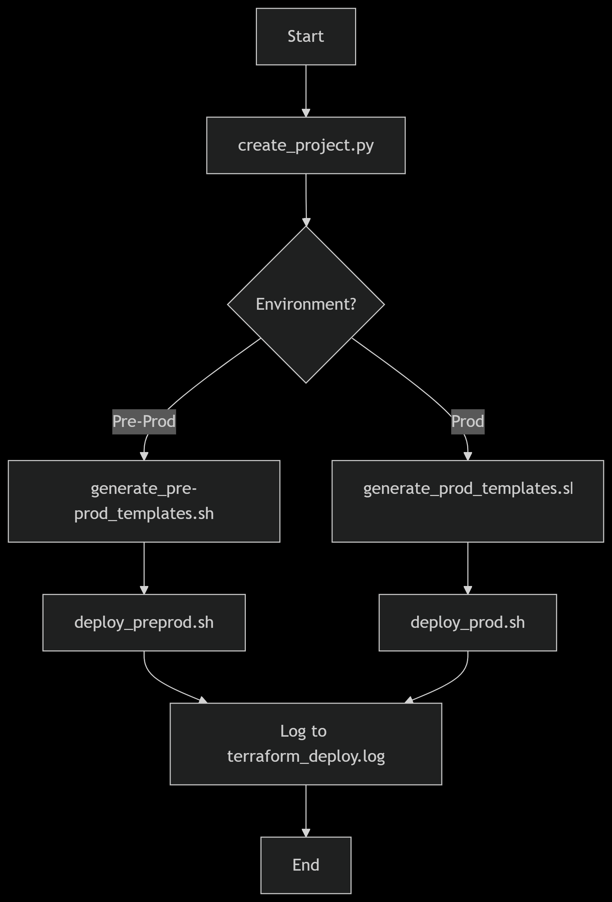

# Terraform Automation Scripts

This repository contains a collection of automation scripts designed to streamline Terraform project creation, template generation, deployment workflows, and diagrams generation. The scripts provide a structured approach to managing infrastructure as code across different environments.

## Repository Structure

```
my_terraform_automation_scripts/
├── README.md
└── my_automation_scripts
    ├── create_project.py
    ├── deploy_preprod.sh
    ├── deploy_prod.sh
    ├── generate_pre-prod_templates.sh
    ├── generate_prod_templates.sh
    ├── generate_terraform_template.sh
    ├── generating_diagrams
    │   ├── architecture.py
    │   └── workflow.mermaid
    ├── set_terraform_env.sh
    ├── terraform_deploy.log
    └── test_script.py

3 directories, 12 files
```

## Script Descriptions

### Main Automation Scripts

1. **create_project.py**  
   The state machine script that orchestrates the project creation workflow. It manages the sequence of operations and maintains state through logs in `terraform_deploy.log`.

2. **deploy_preprod.sh**  
   Bash script for deploying infrastructure to the pre-production environment using Terraform.

3. **deploy_prod.sh**  
   Bash script for deploying infrastructure to the production environment using Terraform.

4. **generate_pre-prod_templates.sh**  
   Generates Terraform code templates specifically configured for pre-production environments.

5. **generate_prod_templates.sh**  
   Generates Terraform code templates specifically configured for production environments.

6. **generate_terraform_template.sh**  
   Base template generation script that creates standard Terraform configuration files.

### Supporting Files

1. **set_terraform_env.sh**  
   Checks for the Terraform environment if exist or not then if exists it copies terraform needed content from folder called template generated by `generate_terraform_template.sh` to the repo directory or generated project directory.

2. **terraform_deploy.log**  
   Log file that tracks the state and progress of operations performed by `create_project.py`.

3. **test_script.py**  
   Just testing the state machine code here to copy it to `create_project.py`.

### Diagram Generation

1. **generating_diagrams/architecture.py**  
   Python script for generating architecture diagrams of the infrastructure. It uses library called diagrams at this docs >>
   [Diagram as Code](https://diagrams.mingrammer.com/docs/getting-started/installation)

2. **generating_diagrams/workflow.mermaid**  
   Mermaid diagram definition file that describes the automation workflow.

## Workflow Diagram

The following Mermaid diagram illustrates the main automation workflow:


## Usage Instructions

1. Begin by running `create_project.py` which will initiate the state machine workflow.
2. The script will prompt for environment selection (pre-production or production).
3. Based on the selection, the appropriate template generation script will be executed.
4. After templates are generated, the corresponding deployment script will run.
5. All operations are logged in `terraform_deploy.log` for tracking and auditing purposes.

## Requirements

- Python 3.x
- Terraform
- Bash shell
- Mermaid (for diagram generation)

## Logging

The `terraform_deploy.log` file maintains a record of all state transitions and operations performed by `create_project.py`, providing visibility into the automation process.

## Contribution

Contributions to improve the automation scripts or add new features are welcome. Please ensure any changes maintain compatibility with the existing state machine workflow.